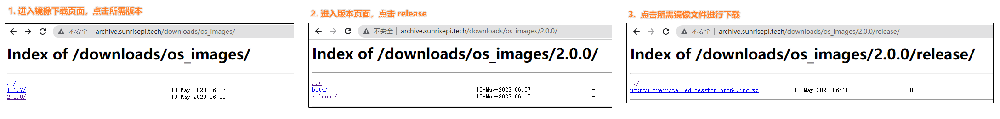
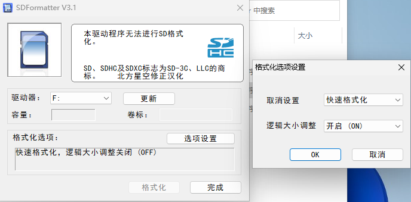
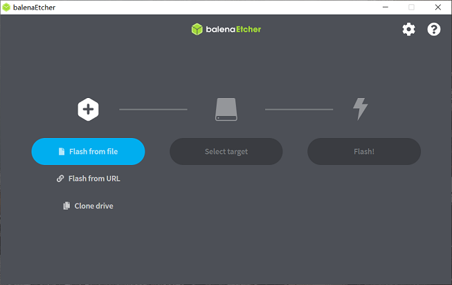
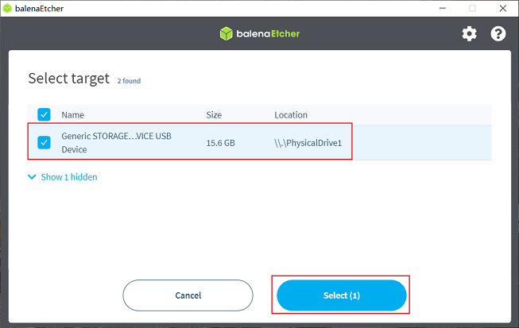
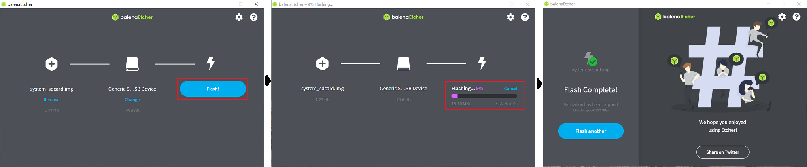

# 系统烧录

CoreMP135 套件目前提供 buildroot, openwrt, debain 系统镜像。根据自己的需求选择自己的镜像。

## 镜像下载

点击 [下载镜像]() ，进入版本选择页面，选择对应版本目录，进入文件下载页。以下载2.0.0版本的系统镜像为例：

下载完成后，解压出Ubuntu系统镜像文件，如ubuntu-preinstalled-desktop-arm64.img

## 磁盘烧录

下面是在 windows 环境下烧录镜像。

> 在烧录Ubuntu系统镜像前，需要做如下准备：
>  - 准备至少8GB容量的Micro SD卡
>  - SD 读卡器
>  - 格式化工具 SDFormatter ([可点击此处下载](https://m5stack.oss-cn-shenzhen.aliyuncs.com/resource/docs/products/CM4STACK/Panasonic_SDFormatter.zip)）
>  - 下载镜像烧录工具balenaEtcher（[可点击此处下载](https://www.balena.io/etcher/)）

第一步：格式化磁盘    
格式化磁盘的主要目的是清理磁盘上的旧分区，为下一步烧写镜像做准备。  

打开软件，选择好驱动器。  
点击 **选项设置** ，开启逻辑大小调整，然后点击 OK 。  
点击格式化，第一次可能出现格式化失败的情况，再次点击格式化就能完成格式化。  

第二步：烧写镜像    
balenaEtcher是一款支持Windows/Mac/Linux等多平台的PC端启动盘制作工具，制作SD启动卡流程如下：

1.打开balenaEtcher工具，点击Flash frome file按钮，选择解压出来的ubuntu-preinstalled-desktop-arm64.img文件作为烧录镜像

2.点击Select target按钮，选择对应的Micro SD存储卡作为目标存储设备

3.点击Flash按钮开始烧录，待工具提示Flash Complete时，表示镜像烧录完成，可以关闭balenaEtcher并取出存储卡

## 启动系统

首先保持开发板断电，然后将制作好的存储卡插入开发板的Micro SD卡槽，给开发板上电。  
系统首次启动时会进行默认环境配置，也可能出现重启的现象，整个过程持续45秒左右，可以连接串口终端，观察启动 log。

常见问题自检：  
- 上电时网口灯有微弱的亮光，启动到网卡驱动后，网口灯量度增加。可用判断是否启动到内核。
- 上电时屏幕不亮，启动到屏幕时，屏幕背光亮起。可用来判断是否启动到内核。

