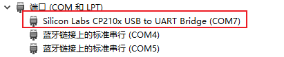
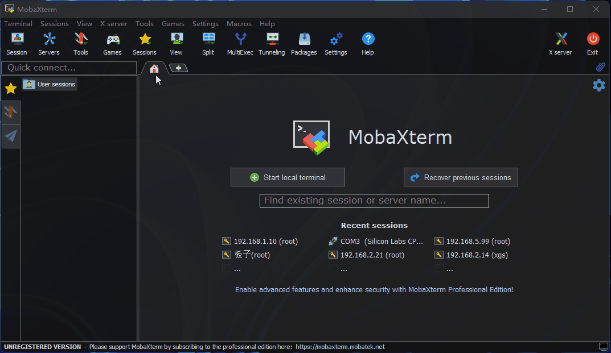
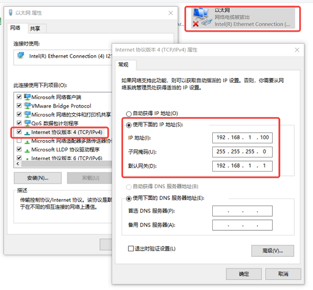
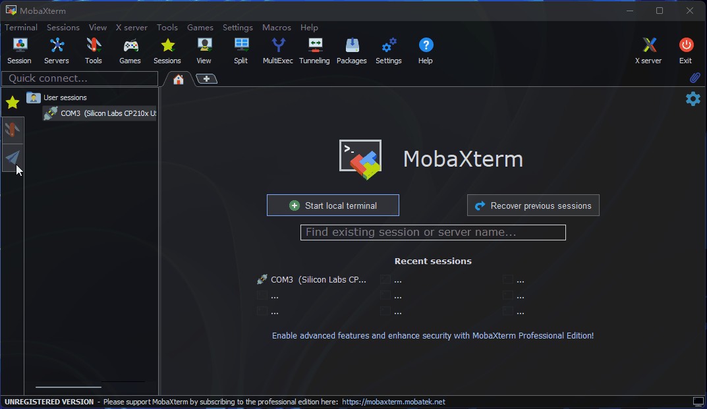
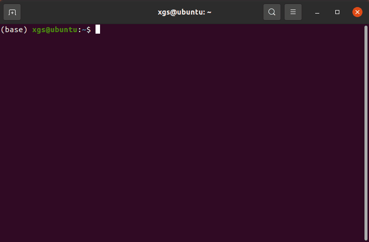

# 系统登陆

本章节旨在向需要通过个人电脑(PC)远程访问开发板的用户介绍如何通过串口、网络(uart、SSH)方式进行远程登录。

CoreMP135 运行有完整的 linux 系统，可在远程登陆后时用 linux 系统。登陆的方式有两种，一种是基于串口的用户登陆。另一种是基于网络的远程登陆，也可通过键盘鼠标的本地登陆。


## 串口登陆

在使用串口登录前，需要确认开发板串口线跟电脑正确连接，连接方法可参考调试串口章节。串口登录需要借助 PC 终端工具，目前常用的工具有 Putty、MobaXterm 等，用户可根据自身使用习惯来选择。不同工具的端口配置流程基本类似，下面以 MobaXterm 为例，介绍新建串口连接过程：

- 当串口USB转接板首次插入电脑时，需要安装串口驱动。驱动程序可从资源中心的工具子栏目获取。驱动安装完成后，设备管理器可正常识别串口板端口，如下图：


- 打开 MobaXterm 工具，点击 Session ，然后选择 Serial

- 配置端口号，例如 COM3，实际使用的串口号以 PC 识别到的串口号为准

- 设置串口配置参数，如下：

| 配置项 | 参数值 |
| --- | --- |
| 波特率（Baud rate）| 115200 |
| 数据位（Data bits）| 8 |
| 奇偶校验（Parity） | None |
| 停止位（Stop bits） | 1 |
| 流控（Flow Control） | 无 |

- 点击OK，输入用户名：root 、密码：root 登录设备




## 网络登陆

ssh 远程登陆。

首先要知道设备的 ip 地址，了解设备的 ip 地址可以通过串口登陆，然后运行 ifconfig 命令获得。其中 eth0、wlan0 分别代表有线、无线网络：

```bash
root@ubuntu:~# ifconfig
eth0: flags=4163<UP,BROADCAST,RUNNING,MULTICAST>  mtu 1500
        inet 192.168.1.10  netmask 255.255.255.0  broadcast 192.168.1.255
        inet6 fe80::211:22ff:feaa:7637  prefixlen 64  scopeid 0x20<link>
        ether 00:11:22:aa:76:37  txqueuelen 1000  (Ethernet)
        RX packets 767  bytes 54006 (54.0 KB)
        RX errors 0  dropped 0  overruns 0  frame 0
        TX packets 5766  bytes 246466 (246.4 KB)
        TX errors 0  dropped 0 overruns 0  carrier 0  collisions 0
        device interrupt 43  base 0xa000  

lo: flags=73<UP,LOOPBACK,RUNNING>  mtu 65536
        inet 127.0.0.1  netmask 255.0.0.0
        inet6 ::1  prefixlen 128  scopeid 0x10<host>
        loop  txqueuelen 1000  (Local Loopback)
        RX packets 3847  bytes 339115 (339.1 KB)
        RX errors 0  dropped 0  overruns 0  frame 0
        TX packets 3847  bytes 339115 (339.1 KB)
        TX errors 0  dropped 0 overruns 0  carrier 0  collisions 0

wlan0: flags=4099<UP,BROADCAST,MULTICAST>  mtu 1500
        ether 08:e9:f6:ae:f8:8a  txqueuelen 1000  (Ethernet)
        RX packets 0  bytes 0 (0.0 B)
        RX errors 0  dropped 0  overruns 0  frame 0
        TX packets 0  bytes 0 (0.0 B)
        TX errors 0  dropped 0 overruns 0  carrier 0  collisions 0
```

网络状态确认

在使用远程登录前，需要确保电脑、开发板网络通信正常，如无法 ping 通，需按如下步骤进行确认：

- 确认开发板、电脑IP地址配置，一般前三段需要是一样的，例如开发板：192.168.1.10 电脑：192.168.1.100  
- 确认开发板、电脑的子网掩码、网关配置是否一致  
- 确认电脑网络防火墙是否处于关闭状态  

开发板有线以太网默认采用静态 IP 模式，IP 地址为 192.168.1.10 。对于开发板、电脑网络直连的情况，只需要将电脑配置为静态 IP ，保证跟开发板处于同一网段即可。以 WIN10 系统为例，电脑静态IP修改方法如下：

- 在网络连接中找到对应的以太网设备并双击打开  
- 找到 Internet 协议版本 4 选项并双击打开  
- 在下图红框位置填入对应的网络参数，点击确定  


如需将开发板有线网络配置为动态获取DHCP模式，可参考有线网络章节进行配置。

SSH 登录  
下面分别介绍终端软件、终端命令行两种方法的创建步骤。

终端软件

目前常用终端工具有 Putty、MobaXterm 等，用户可根据自身使用习惯来选择。不同工具的端口配置流程基本类似，下面以 MobaXterm 为例，介绍新建 SSH 连接过程：

1、打开 MobaXterm 工具，点击 Session ，然后选择 SSH  
2、输入开发板 IP 地址，例如 192.168.1.10  
3、选中 specify username，输入 sunrise  
4、点击 OK 后，输入用户名（root）、密码（root）即可完成登录



终端登陆

用户也可通过命令行方式进行 SSH 登录，步骤如下：

1、打开终端窗口，输入 SSH 登录命令，例如 ssh sunrise@192.168.1.10  
2、弹出连接确认提示，输入 YES  
3、输入密码（root）即可完成登录  
