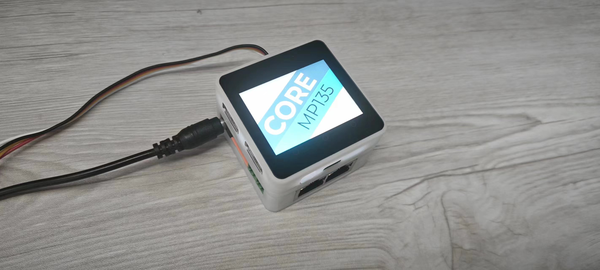

# CoreMP135

<!-- 产品编号：需要替换 -->
<!-- <el-tag class="tag-blue">SKU:K127/K127-US/K127-EU</el-tag> -->

<!-- 产品图片：需替换 -->

## 描述

CoreMP135 是一款基于 stm32mp135 系列芯片的 linux 平台主机。主控 STM32MP135DAE7 ，单核 ARM cortex-A7 高性能处理器，内存1G，主频高达1GHz。可以独立使用或者搭载 M5 bus 扩展板联合使用。产品接口丰富，芯片运行稳定，价格便宜，搭配有 openWRT、debain 等系统，特别适用于工业边缘网关，智能家居，工业自动化，物联网边缘控制网关，机器人运动控制中枢等方面。配合 M5 丰富的传感器和执行器，可快速便捷搭建全智能自动化。

| SKU          | 区别               |
| ------------ | -------------------|
| K127         | 搭配日本电源适配器  |
| K127-US      | 搭配美版电源适配器  |
| K127-EU      | 搭配欧版电源适配器  |

## 特性
- linux 标准平台，深度定制 openWRT 、debian 等稳定系统。
- 丰富的外设接口，拥有全类型的总线接口。
- C/C++/PYTHON/Uiflow 快速便捷编程开发平台。
- 产品长时间运行稳定。
- 丰富的配套传感器执行器。
- 拥有 M5 linux 编程 SDK，大量丰富例程和库，快速开发 linux 平台应用。

## 接口
- 2 X Gigabit Ethernet,
- 2 X USB 2.0 (Type A)
- 1 X USB 2.0 OTG (type C)
- 1 X HDMI Display
- 2 X CAN
- 2 X I2C
- 2 X UART
- 1 X SDcard
- 1 X RS485
- 2.0” IPS Colour LCD 240 X 320 pixel resolution,
- 2.5W Speaker

## 包含

## 应用

- 工业自动化
- 智能家居
- 物联网
- 教育和开发
- 机器人运动中枢控制器

## 规格参数

## 推荐清单

[CoreS3 (K128)](/en/products/sku/K128)

[CORE2 (K010)](/en/products/sku/K010)

[CORE2 FOR AWS (K010-AWS)](/en/products/sku/K010-AWS)

[TOUGH (K034)](/en/products/sku/K034)

[STATION 485 (K123)](/en/products/sku/K123)

[BASIC-V27 (K001-V27)](/en/products/sku/K001-V27)

[M5StickC PLUS (K016-P)](/en/products/sku/K016-P)

[ATOM Lite (C008)](/en/products/sku/C008)

[AtomS3 (C123)](/en/products/sku/C123)

[StampS3 (S007)](/en/products/sku/S007)

[M5PAPER v1.1 (K049-B)](/en/products/sku/K049-B)

## 相关链接

- [CM4Stack快速指南](https://m5stack.oss-cn-shenzhen.aliyuncs.com/resource/docs/products/CM4STACK/CM4Stack%20Development%20Kit.pdf)
- [CM4-datasheet](https://m5stack.oss-cn-shenzhen.aliyuncs.com/resource/docs/datasheet/core/k127%20CM4STACK/cm4-datasheet.pdf)
- [CM4IO-datasheet](https://m5stack.oss-cn-shenzhen.aliyuncs.com/resource/docs/datasheet/core/k127%20CM4STACK/cm4io-datasheet.pdf)
- [ST7789V2](https://m5stack.oss-cn-shenzhen.aliyuncs.com/resource/docs/datasheet/unit/lcd/ST7789V2_SPEC_V1.0.pdf)
- [AW88298](https://m5stack.oss-cn-shenzhen.aliyuncs.com/resource/docs/datasheet/core/k127%20CM4STACK/AW88298.pdf)
- [MP8759](https://m5stack.oss-cn-shenzhen.aliyuncs.com/resource/docs/datasheet/core/k127%20CM4STACK/MP8759.pdf)
- [AW32901](https://m5stack.oss-cn-shenzhen.aliyuncs.com/resource/docs/datasheet/core/k127%20CM4STACK/AW32901.PDF)
- [SY8003](https://m5stack.oss-cn-shenzhen.aliyuncs.com/resource/docs/datasheet/core/k127%20CM4STACK/SY8003.pdf)
- [ME1502](https://m5stack.oss-cn-shenzhen.aliyuncs.com/resource/docs/datasheet/core/k127%20CM4STACK/ME1502.PDF)
- [BM8563](https://m5stack.oss-cn-shenzhen.aliyuncs.com/resource/docs/datasheet/core/k127%20CM4STACK/BM8563.pdf)
- [ATECC608B](https://m5stack.oss-cn-shenzhen.aliyuncs.com/resource/docs/datasheet/core/k127%20CM4STACK/ATECC608B.PDF)
- [AC adapter](https://m5stack.oss-cn-shenzhen.aliyuncs.com/resource/docs/products/CM4STACK/APL-MR0184-01-SNVUU3036-120030SA-221216-V1(0.01)(2).pdf)

## 原理图

## 尺寸图

## 上手指南

## 仓库&&例程

### M5stack-Linux-bsp

- [M5stack-Linux-bsp Clock Demo](https://github.com/m5stack/m5stack-linux-dtoverlays/tree/main/examples/QT/SimpleClock)

- [CM4Stack_lvgl Demo](https://github.com/m5stack/CM4Stack_lvgl)

- [M5Stack-Linux-Libs]()

## 使用权限

## DataSheets

- [CM4-datasheet]()
- [CM4IO-datasheet]()
- [ST7789V2]()
- [AW88298]()
- [MP8759]()
- [AW32901]()
- [SY8003]()
- [ME1502]()
- [BM8563]()
- [ATECC608B]()

