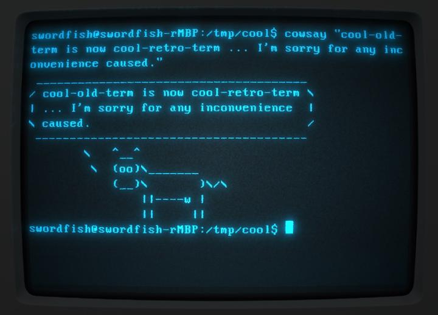
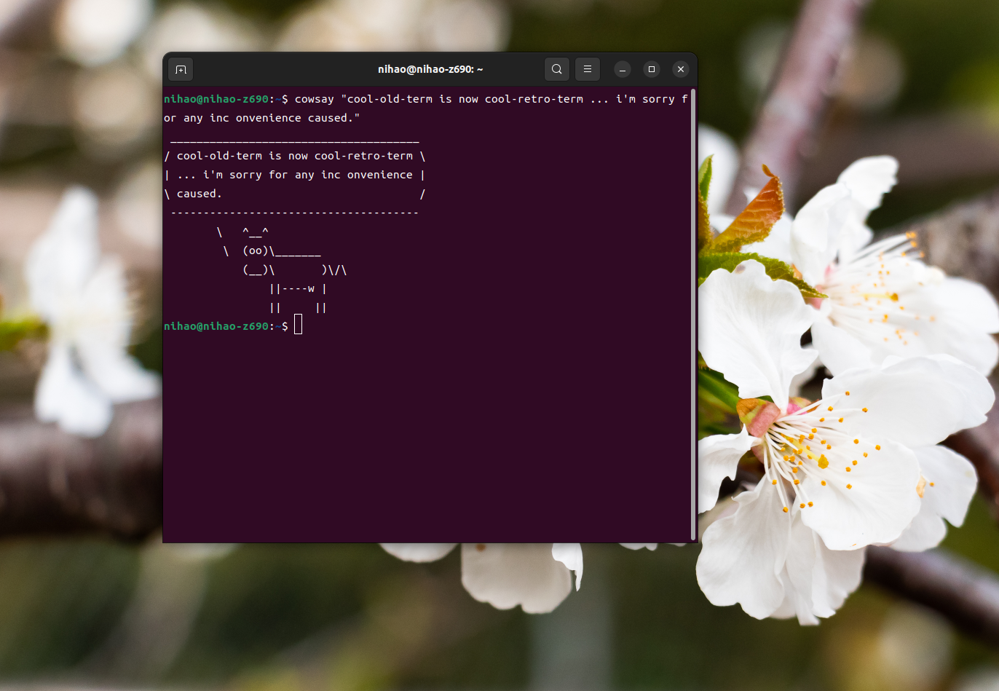
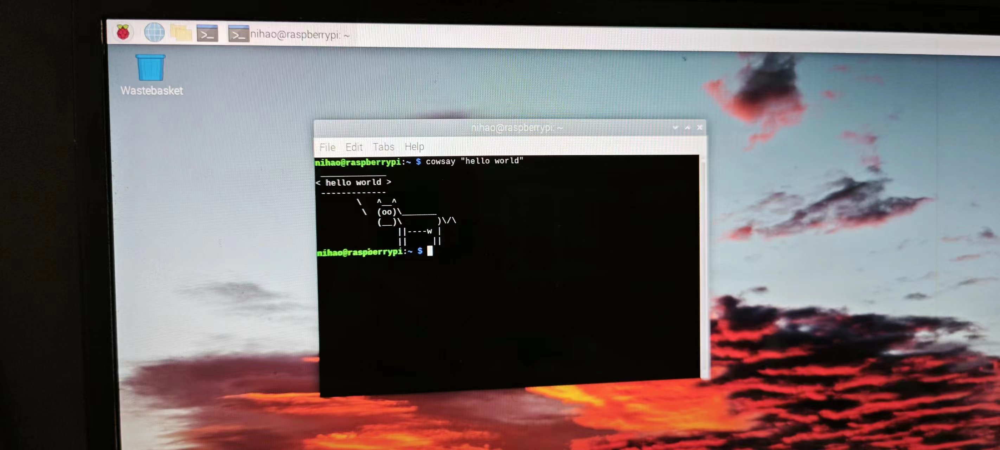

# LINUX 系统基础

本文档致力于给用户快速建立一个 linux 操作系统基础知识,用于操作 linux 设备.  
本文的 linux 命令例子均在树梅派的 linux 操作系统下运行，请在 linux 开箱使用指南的配置完成后再运行下面的命令。

## linux 的来源
世界上第一台计算机被认为是 ENIAC（Electronic Numerical Integrator and Computer），它是一台大规模的电子数字积分器和计算机。ENIAC 于 1945 年在美国宾夕法尼亚州的宾夕法尼亚大学（University of Pennsylvania）建造完成，并于1946年开始投入使用。  
在计算机刚诞生的时候,是没有操作系统的概念.那时候的计算机主要就是一个自动化的计算设备,接收人们的卡片输入,同时使用卡带打孔机输出结果.  
随着集成电路的发展,电子心脏**芯片**出现了,同时性能也在不断的提高.这个时候人力已经跟不上芯片的运行速度了,芯片的本身就是自动的,所以怎样让芯片自动的管理自己便成了电子行业要解决的问题.  
MULTICS 就是这个时期应对芯片自动管理的产物,也是开启操作系统的进程的首个解决方案. MULTICS（Multiplexed Information and Computing Service）项目是由麻省理工学院（MIT）、美国贝尔实验室（Bell Labs）和通用电气（GE）等合作开发的一个操作系统项目。MULTICS 旨在构建一个多用户、多任务的时间共享操作系统，能够在多种硬件平台上运行。然而，由于复杂性和开发困难，MULTICS 项目在实施过程中遇到了许多问题，最终没有完全实现原定的目标。历史的进程往往是由所谓的不务正业的人推动的,在 MULTICS 的开发夭折后,开发员 Ken Thompson 失去了在运行 MULTICS 的大型机上玩游戏的美好时光.为了找回玩游戏的时光, Ken Thompson 将 MULTICS 简化,然后移植到了一台小型机上,以便于能够重新玩游戏.   
至此 unix 诞生了,随着 unix 的发展,可以为其贡献营收的时候 unix 的母公司收回了 unix 免费使用的权限.计算机爱好者和教育者失去了免费的操作系统使用,在这个时候 Andrew S. Tanenbaum 带着他的 MINIX 系统替代了 UNIX 的缺失的位置.从设计和稳定的角度上看 MINIX 的设计是非常先进的,它拥有无与伦比的稳定性.但是同时高稳定性带来的性能损失也是成了 MINIX 的一大缺点,同时的 gnu/heard 就是因为微内核的性能损失而一直难产.此时出于学习和共享态度的 linus 创造并分享了它的 linux 系统.由于 linux 系统的设计难度的降低和开源与共享, linux 迅速的发展了起来,这段时候也出现著名争吵"微内核与宏内核之争".  
 linux 的到来给世界带来了一个免费自由的操作系统,极大的推动的计算机的发展.可以说现代生活的一切几乎都是 linux 在管理和提供.我们学习 linux 系统意义就是学会并掌握现代的工具,有了工具就有了一切.  

## linux 的样子
众里寻他千百度，蓦然回首，那人却在，灯火阑珊处。这句话用来形容 linux 再合适不过了, linux 是一个忠实的电子管家，管理着电子世界的方方面面，它通过一个终端界面与人们交互。在 linux 诞生的时候，计算机已经拥有了显示器，通过显示器名叫控制台的界面和它交互。  

较早的linux显示器控制台


现代的linux显示器控制台


在管理电子设备的时候，一个终端就能管理所有的事物.我们通过在终端输入控制命令，终端给我输出命令的反馈。  

现在可以尝试运行你的第一个 linux 命令，让 linux 牛给你说一句 “hello world！”  

```bash
cowsay "hello world！"
```
将会显示


当成功的让 raspberry 的控制台输出小牛 "hello world!" 的时候恭喜你，你已经进入了 linux 的世界。

现在的 linux 和 windows 一样拥有着 gui 界面。我们可以像操作 windows一样操作着 linux 系统，但是 linux 真正的精髓就是 linux 控制台。我们要学习的就是 linux 控制台中的各种命令。

以下是一些常见的 Linux 系统命令及其简要介绍，这将帮助你更好地开始使用 Linux ：

1. **ls**：列出目录内容。
   - 例子：`ls` 或 `ls -l`（显示详细信息）  
   相当于 windows 查看文件夹中的内容。

2. **cd**：切换工作目录。
   - 例子：`cd /path/to/directory`  
   相当于 windows 打开一个文件夹。

3. **pwd**：显示当前工作目录。
   - 例子：`pwd`  
   由于在控制台中，我们需要手动输入 `pwd` 命令才能查看到当前控制台所在的文件目录。

4. **cp**：复制文件或目录。
   - 例子：`cp source_file destination`  
   复制粘贴一个文件  
   - 例子：`cp -r source_file destination`  
   复制着粘贴一个文件夹

5. **mv**：移动或重命名文件或目录。
   - 例子：`mv old_file new_name`  
   剪贴着粘贴一个文件夹

6. **rm**：删除文件或目录。
   - 例子：`rm file_name` 或 `rm -r directory_name`（删除文件夹）

7. **mkdir**：创建目录。
   - 例子：`mkdir new_directory`

7. **apt**：软件包管理。
   - 例子：`sudo apt update`  
   更新软件包索引
   - 例子：`sudo apt install cowsay`   
   安装 cowsay 软件包
   - 例子：`sudo apt remove cowsay`   
   删除 cowsay 软件包

8. **cat**：显示文件内容。
   - 例子：`cat file_name`

8. **man**：查看一个命令的帮助信息。
   - 例子：`man cat`  
   按下 q 退出。

这些命令是入门时的一些基础，帮助你在 Linux 系统中进行常见的文件操作。这 8 个是必记的命令，学会了这些，你就能简单的操作 linux 系统了。随着你的学习和经验增加，你会逐渐熟悉更多的命令和高级操作。不要害怕尝试和探索，使用`man`命令查阅手册页是学习的好方法，上网搜索也可以。一般情况下，使用 `ctrl + c` 命令就能结束正在运行的命令。比如运行 `man cat` 时，上下键可以上下翻阅，需要退出的时候可以按下 `ctrl + c` 或者 `q` 。   
关于第 7 项， apt 的软件包管理。在 linux 系统中，安装软件和 windows 有些差异，主要的差异是 windows 的软件更多的是以商业发行为主，windows 系统提供统一的运行库，而软件也是以独立的安装包发布的。但是 linux 系统是自由的免费的，无论是系统运行库还是软件发布包都是由各个 linux 发行版的组织则者决定的，各种 linux 发行版都会提供一个包管理工具，相当于 windows 应用商店。由于单独的软件大都需要编译然后才能使用，安装和卸载比较复杂，对使用者要求较高，所以 linux 发行版的软件管理比较依赖软件包管理器。apt 属于 debian 系的包管理工具，我们的产品也以 debian 系的系统为主。学会使用包管理器对使用 linux 至关重要。  


更多的命令：  
9. **grep**：在文件中搜索指定模式。
   - 例子：`grep pattern file_name`

10. **ps**：显示进程信息。
    - 例子：`ps aux`

11. **top**：实时显示系统资源使用情况。
    - 例子：`top`

12. **df**：显示磁盘空间使用情况。
    - 例子：`df -h`

13. **free**：显示内存使用情况。
    - 例子：`free -h`

14. **sudo**：以超级用户权限执行命令。
    - 例子：`sudo command`

15. **man**：查看命令的手册页，获取详细信息。
    - 例子：`man command`

16. **ping**：测试网络连通性。
    - 例子：`ping example.com`

Linux 系统命令有数百个，涵盖了各种任务和功能。这些命令可以用于文件操作、系统管理、网络配置、软件安装、进程控制、系统信息查看等等。尽管不可能列出所有的命令，但我可以提供一些常见的和重要的 Linux 系统命令的示例：

1. **文件和目录操作命令：**
   - `ls`: 列出目录内容。
   - `cd`: 切换工作目录。
   - `pwd`: 显示当前工作目录。
   - `cp`: 复制文件或目录。
   - `mv`: 移动或重命名文件或目录。
   - `rm`: 删除文件或目录。
   - `mkdir`: 创建目录。
   - `rmdir`: 删除空目录。
   - `touch`: 创建空文件或更新文件的访问和修改时间。
   
2. **文本处理命令：**
   - `cat`: 显示文件内容。
   - `grep`: 在文件中搜索指定模式。
   - `sed`: 对文件中的文本进行流编辑。
   - `awk`: 强大的文本处理工具。
   
3. **系统管理和信息命令：**
   - `ps`: 显示进程信息。
   - `top`: 实时显示系统资源使用情况。
   - `df`: 显示磁盘空间使用情况。
   - `free`: 显示内存使用情况。
   - `ifconfig` 或 `ip`: 配置和显示网络接口信息。
   - `uname`: 显示系统信息。
   - `who` 和 `w`: 显示登录用户信息。
   
4. **软件包管理命令：**
   - `apt` 或 `apt-get`（Debian/Ubuntu）, `dnf`（Fedora）, `yum`（CentOS）: 管理软件包安装和更新。
   
5. **用户和权限管理命令：**
   - `useradd` 和 `userdel`: 添加和删除用户。
   - `passwd`: 更改用户密码。
   - `chown` 和 `chmod`: 修改文件或目录的所有权和权限。

6. **进程控制命令：**
   - `kill`: 终止进程。
   - `ps`: 显示进程信息。
   - `top` 或 `htop`: 实时查看和管理进程。
   - `pgrep` 和 `pkill`: 通过进程名查找和终止进程。
   
7. **网络命令：**
   - `ping`: 测试网络连通性。
   - `netstat`: 显示网络状态和统计信息。
   - `ssh`: 远程登录到其他主机。
   - `scp`: 在本地和远程主机之间复制文件。

这只是 Linux 系统命令的一个小样本，还有许多其他命令用于不同的任务和场景。您可以通过在终端中键入 `man` 命令名来查看命令的手册页，以获得有关命令的更多详细信息和用法。也建议复制命令到百度或者谷歌了解这些命令的详细信息，上面会有更加详细更加符合你的口味的命令解释。

## 后记
linux 系统的使用难度相对于 windows 是比较大的，但是 linux 是一个忠实的电脑管家，如果你学会正确的给它下达命令，那它就能完美的解决你的问题。同样的，linux 的嵌入式产品使用要比单片机困难的多，比如最简单的读写寄存器，在 linux 上你需要内存映射来完成。linux 中几乎对所有的外设都做了子系统的抽象，好处是在做好的嵌入式设备上使用配置好的外设时比较简单，一旦涉及到适配外设等驱动问题时，难度就会指数级的上升。所以对于刚入门的用户会感到困难和困惑，但请不要焦虑和生气，linux 系列的产品基本都是开源的，我们也已经尽可能的提供linux嵌入式设备的原材料。你可以在其他任何 linux 社区找到 linux 相关问题的解决，不要局限于本文档。记住，linux 是开放的自由的包容的。你买到的是我们产品具体的形态，体验的是整个 linux 生态。请尝试去解决问题，如果有好的解决方案，也欢迎分享，我们将会铭记你的名字。生命在于运动，linux 在于探索！

## 参考
[1] arch wiki, https://wiki.archlinux.org/  
[2] arch 中文wiki, https://wiki.archlinuxcn.org/wiki/%E9%A6%96%E9%A1%B5  
[3] Raspberry Pi OS, https://www.raspberrypi.com/software/  


