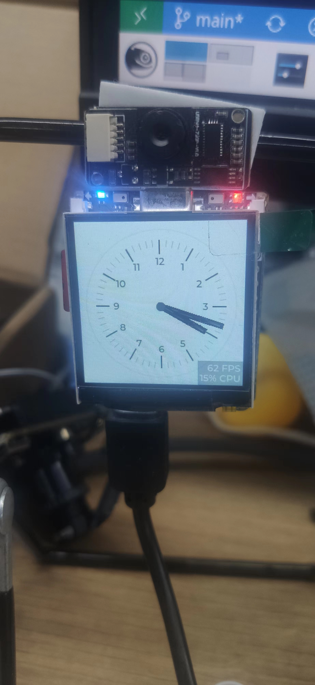

# CM4Stack_lv_fbdev

Lvgl Demo for CM4STACK


#### File tree

```
.
├── demo.jpg
├── LICENSE
├── lv_conf.h
├── lv_drivers
├── lv_drv_conf.h
├── lvgl
├── main.c
├── Makefile
├── mouse_cursor_icon.c
└── README.md
```


#### Build

cm4stack
```
make
```

ubuntu cross compile
```
make CROSS=arm-linux-gnueabihf-
```

#### Run

```
./demo /dev/fb$(cat /proc/fb | grep fb_st7789v | awk '{print $1}')  /dev/input/event$(cat /proc/bus/input/devices | grep fe205000.i2c | tail -c 2)
```

